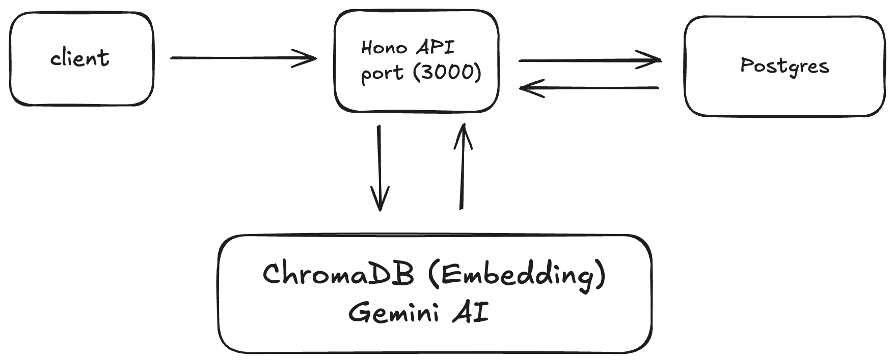

# AI CV Screening System

Automated job application screening using AI to evaluate CVs and project reports.

## Architecture



## Features

- PDF upload and processing
- AI-powered evaluation with detailed scoring
- Background job processing
- REST API with Swagger documentation

## Quick Start

### 1. Install Dependencies
```bash
bun install
```

### 2. Set Environment
```bash
cp .env.example .env
# Add your GEMINI_API_KEY to .env
```

### 3. Start Services
```bash
# Start ChromaDB and Redis
docker-compose up -d

# Start application
bun start
# or with PM2
pm2 start bun --name cv-screening -- src/server.ts
```

### 4. Access API
- **API**: http://localhost:3000
- **Swagger**: http://localhost:3000/swagger
- **Health**: http://localhost:3000/health

## API Usage

### Upload Documents
```bash
curl -X POST http://localhost:3000/upload \
  -F "cv=@cv.pdf" \
  -F "project-report=@project.pdf"
```

### Start Evaluation
```bash
curl -X POST http://localhost:3000/evaluate \
  -H "Content-Type: application/json" \
  -d '{
    "jobTitle": "Product Engineer (Backend)",
    "cvDocumentId": "cv_id",
    "projectReportId": "project_id"
  }'
```

### Check Results
```bash
curl http://localhost:3000/status/{jobId}
```

## Scoring System

**CV Evaluation (1-5 scale)**
- Technical Skills Match (40%)
- Experience Level (25%)
- Relevant Achievements (20%)
- Cultural Fit (15%)

**Project Evaluation (1-5 scale)**
- Correctness (30%)
- Code Quality (25%)
- Resilience (20%)
- Documentation (15%)
- Creativity (10%)

## Environment Variables

```bash
GEMINI_API_KEY=your_gemini_api_key
PORT=3000
REDIS_URL=redis://localhost:6379
CHROMA_URL=http://localhost:8000
```

## License

Case study submission for backend developer evaluation.
