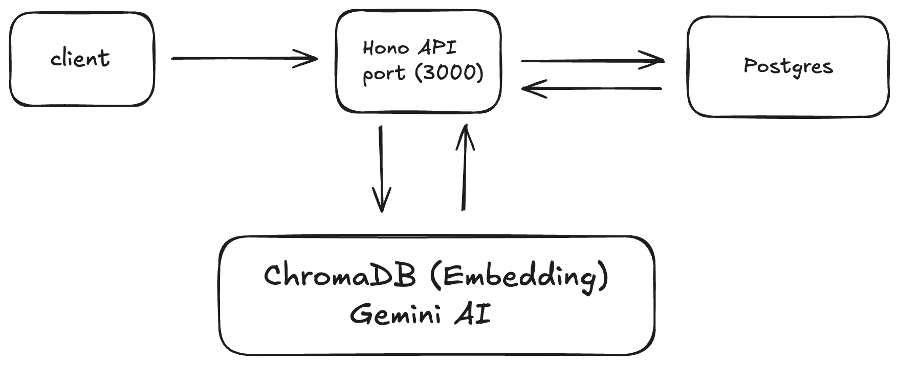

# AI CV Screening System

Automated job application screening using AI with Gemini, ChromaDB, PostgreSQL, and Docker.

## ARCHITECTURE



## Quick Start

### 1. Get Gemini API Key
- Visit [Google AI Studio](https://makersuite.google.com/app/apikey)
- Copy your API key

### 2. Setup Environment
```bash
cp .env.example .env
```

Edit `.env` and add your API key:
```bash
GEMINI_API_KEY=your-gemini-api-key-here
```

### 3. Start Application
```bash
docker-compose up -d
```

### 4. Access Application
- **API**: http://localhost:3000
- **Swagger Docs**: http://localhost:3000/swagger
- **Health Check**: http://localhost:3000/health

## API Usage

Visit the Swagger Documentation at http://localhost:3000/swagger for:
- Complete API documentation
- Interactive testing
- Request/response examples

**Quick Workflow:**
1. Create Account → `/api/auth/signup`
2. Upload Documents → `/api/upload`
3. Start Evaluation → `/api/evaluate`
4. Check Results → `/api/status/{jobId}`

## Docker Commands

```bash
# Start all services
docker-compose up -d

# Stop all services
docker-compose down

# Rebuild after changes
docker-compose up --build

# View logs
docker-compose logs -f

# Check status
docker-compose ps
```

## Development Setup

For local development:

1. Install dependencies:
```bash
bun install
```

2. Start services:
```bash
docker-compose up postgres chromadb -d
```

3. Run app:
```bash
bun run dev
```

## Troubleshooting

**ChromaDB Issues?**
- Ensure `CHROMA_URL=http://chromadb:8000` in `.env`
- Rebuild containers after config changes

**Port in use?**
```bash
lsof -i :3000
kill -9 <PID>
```

---

*Case study submission for backend developer evaluation.*
